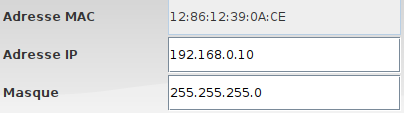





{{ titre_chapitre(num,titre,theme)}}
 
## Activités 

{{ titre_activite("Adresses",[],0) }}

On utilise le logiciel [Filius](https://www.lernsoftware-filius.de/) qui permet de simuler des réseaux, commencer par lancer Filius en utilisant le menu des applications ou via la ligne de commande.

1. Placer un ordinateur, afficher sa configuration, et cocher la case "Utiliser l'adresse {{ sc("ip")}} comme nom".

    !!! aide
        Vérifier que vous êtes bien en mode conception (icone marteau), cliquer à droite sur l'ordinateur pour afficher sa configuration

    Vous devriez voir apparaître les éléments suivants :
    

2. Adresse MAC
    1. Dans Filius, l'adresse MAC est-elle modifiable ? Quel est son format ?
    2. Rechercher la signification de cette adresse sur le *Web*.
    3. Quel périphérique d'un ordinateur est identifié de façon unique par son adresse MAC ?

3. Adresse IP
    1. L'adresse IP est-elle modifiable ?
    2. Filius affichera en rouge une adresse IP non valide, en testant différentes valeurs conjecturer le format d'une adresse IP valide.
    3. Sur combien d'octets peut-on coder une adresse IP ?

4. Masque

{{ titre_activite("Protocoles",[]) }}

## Cours

{{ cours("CHEMIN VERS PDF DE COURS") }}

## QCM

{{qcm_chapitre(num)}}

## Exercices

{{ exo("TITRE EXO 1",[],0) }}

CONTENU EXO 1

{{ exo("TITRE EXO 2",[]) }}

CONTENU EXO 2

{{ exo("TITRE EXO 3",[]) }}

CONTENU EXO 3